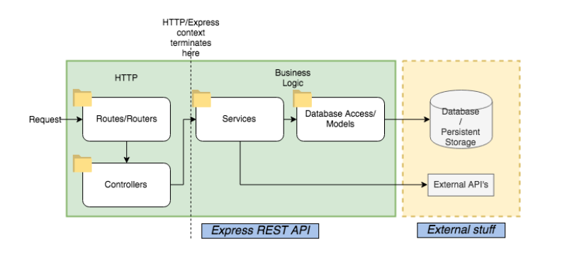

# STRUCTURE CODE



# INSTALASI

- ```.env``` setup
```
    APP_NAME = Gembala App
    VERSION = 1.0.0

    DB_USERNAME = root
    DB_PASSWORD = 
    DB_HOSTNAME = localhost
    DB_NAME = sembadafarm_db
    DB_DIALECT = mariadb

    NODE_ENV = development

    URL = http://localhost:51009

    APP_PORT = 51009
```
- install dependency ``` npm i ```
- create a new database with the name of `sembadafarm_db`
- migrate database ``` npm run migrate ```
- run app ``` npm run dev ```


# DOC API POSTMAN

https://documenter.getpostman.com/view/16756766/2s83eyrcXr

# TODO

## General 

- [x] Login
- [x] Register
- [x] Verify Account
- [x] Forgot Password
- [x] Update Profile
- [x] Change Password

## Mobile

- [x] Dashboard aplikasi
- [x] Feature kandang
    - [x] Get ternak by kandang
- [x] Feature Ternak
    - [x] Filtering ternak
    - [x] Category ternak
    - [x] Detail ternak
    - [x] Update ternak
    - [x] Riwayat penyakit
    - [x] Grafik ADG 
- [x] Feature Kesehatan
    - [x] penyakit
    - [x] kesehatan
- [x] Feature Pakan
    - [x] Management bahan pakan
    - [x] Management pakan
- [x] Feature Perkawinan
    - [x] data perkawinan ternak
    - [x] riwayat perkawinan ternak
- [x] Lembar kerja
    - [x] Pemasukan 
        - [x] riwayat pemasukan ternak
        - [x] integration rfid
    - [x] Adaptasi
        - [x] Adaptasi 1
        - [x] Adaptasi 2
        - [x] Adaptasi 3
        - [x] Adaptasi 4
        - [x] Adaptasi 5
        - [x] Riwayat treatment ternak
    - [x] Perkawinan
        - [x] Create perkawinan
        - [x] Checking ternak perkawinan
        - [x] record riwayat perkawinan
        - [x] tracking status kebuntingan
    - [x] Kebuntingan
        - [x] record riwayat kwbuntingan ternak
        - [x] Check indukan if afkir
    - [x] Kelahiran
        - [x] add cempe ternak
        - [x] move indukan to lacatation fase
        - [x] Check indukan if afkir
    - [x] Lepas Sapih
        - [x] move ternak to lepas sepih fase
        - [x] move indukan to perkawinan fase
        - [x] ternak selection

## Dashboard 

- [x] Dashboard summary
    - [x] Grafik population, ternak masuk, ternak keluar
    - [x] Diagram total ternak by jenis ternak (status, jenis kelamin)
    - [x] Total kandang
    - [x] Total ternak
    - [x] Total ternak by fase
    - [x] Grafik ADG cempe
    - [x] Total ternak by status keluar (Trejual, Disembelih, Mati)
    - [x] Total populasi ternak by kandang
- [x] Monitoring
    - [x] Ternak
        - [x] List Ternak
        - [x] Detail ternak
        - [x] Create ternak
        - [x] Update Ternak
    - [x] Perkawinan
    - [x] Kesehatan
        - [x] Master data penyakit
        - [x] List ternak sakit
        - [x] Detail ternak sakit
    - [x] Pakan
        - [x] Managemen pakan ternak
        - [x] Managemen bahan pakan
    - [x] Kandang
        - [x] List kandang
        - [x] List ternak by kandang
- [x] Monitoring Fase
    - [x] Pemasukan
    - [x] Adaptasi
    - [x] Perkawinan
    - [x] Kebuntingan
    - [x] Kelahiran
    - [x] Lepas Sapih
- [x] Lembar Kerja
    - [x] Pemeliharaan
    - [x] Penanganan Penyakit
# BackEnd-GembalaApps
